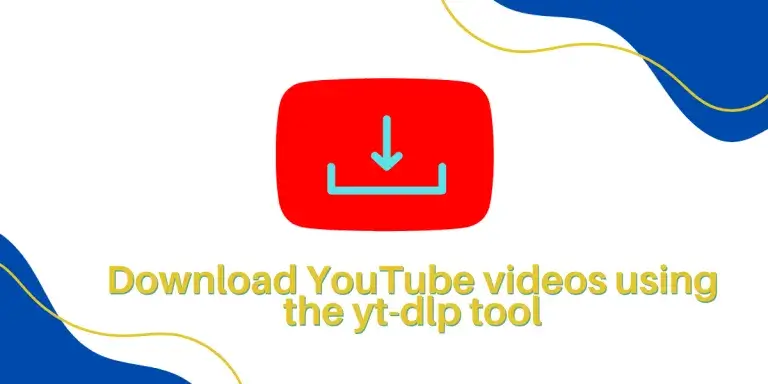

#### Options {#options}

Настройки: ключей. Полный список в [реозитории](https://github.com/yt-dlp/yt-dlp#general-options). 

| Name | Short | Description |
| --- | --- | --- |
| `--list-formats` | `-F` |  List available formats of each video. |
| `--format` | `-f` | Video format code |

Со сторонних сайтов искать плейлисты в формате `m3u8`.

Со временем пользования программой понял, что лучше всего
скачивать ролики в формате **mp4**. Так как они понимаются
наибольшим числом плееров.

Для этого добавлять в команду ключи:

```bash
--format "bestvideo+bestaudio[ext=m4a]/bestvideo+bestaudio/best" --merge-output-format mp4
```

А так же, что при скачивании с `youtube` не обязательно сохранять номер видеоролика. Достаточно названия файла и его расширения.

```bash
-o '%(title)s.%(ext)s'
```

Для плейлиста, иногда имеет смысл скачивать так же и номер ролика.
Например если это какая то лекция

```bash
-o '%(playlist_index)s.%(title)s.%(ext)s'
```

## скачивание плейлистов с youtube

Пример с линуксами.

```bash
youtube-dl -o '%(title)s.%(ext)s' --format "bestvideo+bestaudio[ext=m4a]/bestvideo+bestaudio/best" --merge-output-format mp4 --yes-playlist https://youtube.com/playlist?list=PLisqB92_b4TlQH3jVGf6lrFMVqalCTjAQ
```

## Одиночное видео

```bash

film='linc'
youtube-dl -o '%(title)s.%(ext)s' --format "bestvideo+bestaudio[ext=m4a]/bestvideo+bestaudio/best" --merge-output-format mp4 $film

```

Пример с машей и медведем.

```bash
yd -o '%(title)s.%(ext)s' --yes-playlist https://youtube.com/playlist?list=PLXnIohISHNIur5SkRfvOLo1YJjw7NwQx6
```

Команды которые я часто использую.

Загрузка видеороликов из списка в файле

```bash
youtube-dl -f best -a list.txt
```

для скачивания плейлиста [youtube](https://youtube.com)

```bash
--yes-playlist
```

youtube-dl -ct --simulate --batch-file='/path/to/batch-file.txt'

### Thumbnails

Изображения заставки.
Изображения скачиваются флагом `--write-thumbnail`

```sh
yt-dlp --skip-download --write-thumbnail --convert-thumbnails jpg 
```

### Файл конфигурации

В случае регулярного использования команд можно задать файл конфигурации`yt-dlp.conf`

:::tip My tip

Use this awesome feature option

:::

Пример для скачивания `youtube` роликов через сервис [colab](https://colab.research.google.com/drive/1VYZOzBjoacWr7s9Al-J932byqaylRunW)

```shell title="yt-dlp.conf"

# Lines starting with # are comments
# Formats

# Best "mp4"
-f 22/bestvideo[ext=mp4]+bestaudio[ext=m4a]/best[ext=mp4]/best

# Templafe folder
-P "./videos/"
# Save all videos under YouTube directory in your home directory
-o %(title)s/%(title)s.%(ext)s

# Embed datas to video
--embed-chapters 
--embed-thumbnail 
--add-metadata

# Convert thumbnails to jpg
--convert-thumbnails "jpg"

# Save thumbnail with 'folder.jpg' name
--write-thumbnail -o "thumbnail:%(title)s/folder.%(ext)s"

# links
# - [yt-dlp - репа](https://github.com/yt-dlp/yt-dlp)
# - [yt-dlp - опции](https://github.com/yt-dlp/yt-dlp#usage-and-options)
# - [yt-dlp - примеры](https://github.com/yt-dlp/yt-dlp#output-template-examples)
```


## links

- [yt-dlp - репа](https://github.com/yt-dlp/yt-dlp)
- [yt-dlp - опции](https://github.com/yt-dlp/yt-dlp#usage-and-options)
- [yt-dlp - примеры](https://github.com/yt-dlp/yt-dlp#output-template-examples)
